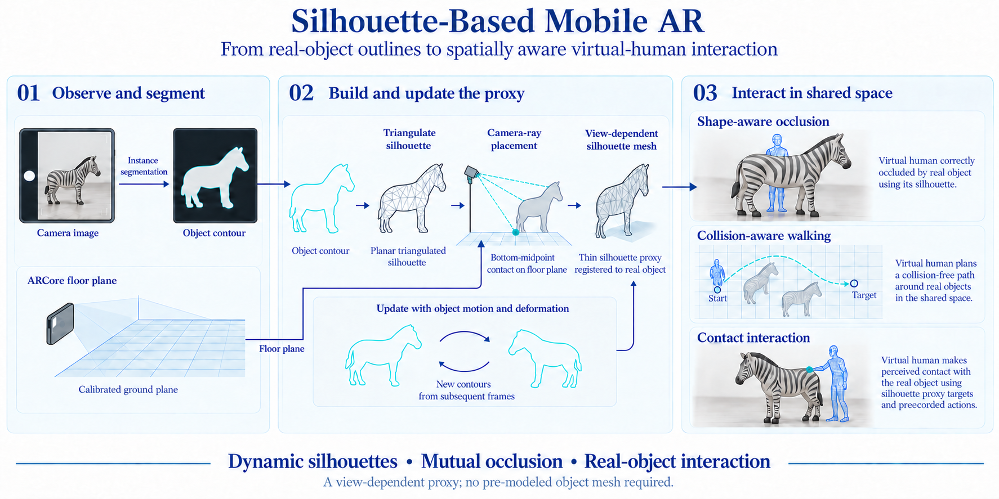

# Silhouettes from Real Objects Enable Realistic Interactions with a Virtual Human in Mobile Augmented Reality

**Hanseob Kim, Ghazanfar Ali, Andréas Pastor, Myungho Lee, Gerard J. Kim, Jae-In Hwang**

**Applied Sciences · 2021** · Published

[Paper / publisher](https://doi.org/10.3390/app11062763) · [Project page](https://ghazanfarali.com/research/silhouette-mobile-ar/) · [Video presentation](https://www.youtube.com/watch?v=75P9iV8M8e8) · [BibTeX](CITATION.bib) · [Requirements](REQUIREMENTS.md) · [Code & setup](#implementation-and-usage)

> Real-object silhouettes give virtual humans spatial context in mobile AR.



*Graphical abstract diagram. Dynamic silhouette proxies support shape-aware occlusion, collision-aware walking and contact with real objects.*

## Why this research

Pre-modeled object proxies are difficult to maintain when a real object's shape or viewpoint changes. Dynamic silhouettes provide visible-shape geometry for virtual-human interaction using the device camera.

A lightweight segmentation pipeline constructs silhouette geometry from camera images of real objects. A virtual character can interact with this geometry and be occluded by it without a pre-modeled object proxy. A mobile animal-doll scenario tests changing views and object deformation.

## Method at a glance

**Camera image** → **Segmentation + silhouette** → **Spatially aware AR interaction**

| | Research system |
|---|---|
| Input | Device-camera images of real objects |
| Method | Segmentation and dynamic silhouette geometry |
| Output | Silhouette geometry for virtual-human occlusion and interaction |

## Evidence and scope

Paper reports a 2.4M-parameter model, 0.971 mIoU, and a 24-person pilot study

**Attribution:** These findings describe the paper or manuscript, not results obtained with this repository's code.

**Study context:** Mobile AR animal-doll scenario.

**Limitations:** Silhouette geometry approximates visible shape; it is not a complete reconstruction of hidden 3D object geometry.

## Explore the implementation

Segmentation adapters, contour geometry, triangulation, calibrated projection, occlusion, contact targets and path planning. No mobile AR tracking stack or original segmentation weights are supplied.

This repository contains independently written research code. The institute's original source, datasets and trained models are not distributed. Public-data preparation, commands, assumptions and checks are documented below and in [REQUIREMENTS.md](REQUIREMENTS.md).

## Resources and citation

Read the paper through its [publisher record](https://doi.org/10.3390/app11062763). PDFs are hosted by publishers or preprint archives rather than stored in this repository.

Watch the [existing YouTube presentation](https://www.youtube.com/watch?v=75P9iV8M8e8).

Please cite the research paper when using its ideas; [download the BibTeX citation](CITATION.bib). The implementation has its own documented scope.

## Implementation and usage

<!-- implementation-guide -->

This standalone repository reimplements the core geometry from **“Silhouettes from Real Objects Enable Realistic Interactions with a Virtual Human in Mobile Augmented Reality”** by Hanseob Kim, Ghazanfar Ali, Andréas Pastor, Myungho Lee, Gerard J. Kim, and Jae-In Hwang, *Applied Sciences* 11(6), 2763, 2021. DOI: [10.3390/app11062763](https://doi.org/10.3390/app11062763).

The original institute code, Unity/ARCore application, model, and experimental assets are unavailable. This independent implementation turns segmentation masks into contoured and triangulated view-dependent proxies, projects them relative to a floor plane, and uses them for occlusion, contact targets, and collision-aware routing. It does not reproduce the paper's DollDataset, trained network, mobile timings, virtual human, or pilot-study results.

### Immediate browser demo

```powershell
py -3.11 -m venv .venv
.venv\Scripts\Activate.ps1
pip install -e .
python scripts/prepare_viewer.py
python -m silhouette_ar.demo
```

Open `http://127.0.0.1:8763` and choose the labeled procedural mask example. The real mask and optional segmentation paths are documented below.

### Detailed setup and checks

```powershell
py -3.11 -m venv .venv
.venv\Scripts\Activate.ps1
python -m pip install --upgrade pip
pip install -e ".[dev]"
pytest -q
```

Install `.[yolo,dev]` instead to infer masks with Ultralytics segmentation weights.

### Procedural verification

Run `python scripts/verify.py` after installation. It creates a binary object mask in memory and passes it through the production connected-component, contour, triangulation, calibrated projection, occlusion, obstacle-grid, and path-planning code. Inspect the mask, composite, mesh, targets, and path under `outputs/verify/`. For real inputs, supply a reviewed binary mask to the CLI or replace it with `YoloSegmenter.segment(frame)` output; camera intrinsics and world/floor calibration remain the same geometry contract.

### Use a mask

Supply camera intrinsics and the camera height above a horizontal floor. The CLI convention is image `y` down, world `y` up, camera looking along world `+z`, and floor `y=0`:

```powershell
silhouette-ar --mask .\object-mask.png --label doll --min-area 500 `
  --fx 920 --fy 920 --cx 640 --cy 360 --camera-height 1.4 `
  --output .\silhouettes.json
```

The JSON contains pixel contours, triangle indices, world vertices, floor contact, and point/approach/touch/ride targets. Mobile integrations should call `build_meshes` with their calibrated intrinsics, camera-to-world rotation, camera origin, and detected floor plane.

For a YOLO segmentation model:

```powershell
silhouette-ar --image .\frame.jpg --weights .\runs\segment\train\weights\best.pt `
  --fx 920 --fy 920 --cx 640 --cy 360 --output .\silhouettes.json
```

### Prepare or train segmentation

The code accepts any binary mask, so the smallest reproducible path is to export reviewed masks from your own frames. For public training data, [COCO](https://cocodataset.org/#download) provides images and instance-segmentation annotations; review the [COCO terms](https://cocodataset.org/#termsofuse) and each image's source license before redistribution. Convert chosen categories to the standard Ultralytics segmentation format and define `dataset.yaml`.

Train a current model from architecture initialization (no pretrained weights):

```powershell
yolo segment train model=yolo11n-seg.yaml data=.\dataset.yaml epochs=100 imgsz=640
```

Using `model=yolo11n-seg.pt` fine-tunes public pretrained weights instead. Follow the official [Ultralytics segmentation dataset guide](https://docs.ultralytics.com/datasets/segment/) and [training guide](https://docs.ultralytics.com/modes/train/). No dataset or model is stored here.

### Geometry and interaction semantics

For each connected mask instance, the pipeline traces and simplifies its outer contour, ear-clips the polygon, intersects the contour's bottom-midpoint ray with the floor, and places every contour ray at that reference distance. The result matches the visible outline from the current camera and tilts with the view. It is deliberately a 2.5D proxy: it has no hidden surfaces and must be updated when the view, object, or mask changes.

`occlusion_composite` hides virtual pixels behind the per-pixel real-object mask and can compare virtual/object depth maps per pixel. Each mesh exposes a visible-width floor strip; `rasterize_world_footprints` turns those polygons into walkable-floor holes and `astar_path` routes around them. `interaction_targets` exposes reproducible points for pointing, approaching, touching/pushing/petting, and riding. A renderer or animation system remains responsible for IK, depth ordering, temporal tracking, and safe physical behavior.

### Dataset and local browser viewer

The [KISTMRLab DollDataset](https://github.com/KISTMRLab/DollDataset) lists doll image folders and a CC BY 4.0 license. Its repository listing does not establish aligned segmentation masks. Download it yourself outside this repository, then run `python -m silhouette_ar.dataset <downloaded-directory>` to inventory images and annotation-like candidates. Inspect any candidates before treating them as masks. If masks are absent, draw/review binary foreground masks for selected frames, or run a separately obtained segmentation checkpoint (`--weights` in the Python CLI). Do not treat a thresholded photograph as ground-truth segmentation. Nothing from that dataset is bundled here.

Run `python scripts/prepare_viewer.py` to fetch a pinned Three.js module into ignored `static/vendor/`, then `python -m silhouette_ar.demo` and open `http://127.0.0.1:8763`. Select a reviewed binary mask or the labeled procedural example. The backend extracts connected components, contours, triangles, calibrated floor-ray vertices, contact targets, and a path around a visible-width floor strip. The 3D viewer displays those outputs and a procedural animated guide. For actual image segmentation, start `python -m silhouette_ar.demo --weights <segmentation-checkpoint>` and use `/api/segment` through a host integration; the browser's ordinary upload is intentionally a mask input. Calibration shown in the viewer is a declared example until device intrinsics and pose are supplied.

The [automatic-text-to-gesture research implementation](https://github.com/ghazanPK/automatic-text-to-gesture) is a possible gesture animation integration for virtual-human behavior; it is not required by this geometry repository. Run `python scripts/verify.py` and `pytest -q` for geometry, occlusion, targets, and navigation checks.

<!-- avatar-recorded-motion:start -->
## Bundled characters and recorded public motion

The browser demos include Rowan and Mira, two new fictional GLB characters built with MPFB and MakeHuman community assets under CC0 1.0. See [avatar licensing and provenance](static/avatars/LICENSE.md). Use the character selector in the stage. The shared renderer supports body bones, ARKit facial channels, and approximate speaking motion.

The [recorded BEAT motion companion](static/recorded-motion.html) opens at `/static/recorded-motion.html` while the demo server is running. It plays locally selected motion, face, and WAV files on the bundled characters; this is recorded public-data inspection, separate from the paper implementation. No BEAT recording, dataset archive, or trained model is bundled. Install the one preparation dependency and fetch a small official sample into ignored `outputs/beat-demo/`:

```sh
python -m pip install numpy
python scripts/beat_demo/fetch_modalities.py --speaker 1 --sequence 1_wayne_0_1_1 --include-bvh --max-bytes 25000000 --output-dir outputs/beat-demo/source
python scripts/beat_demo/prepare_bvh.py --bvh outputs/beat-demo/source/1_wayne_0_1_1.bvh --output outputs/beat-demo/sample/1_wayne_0_1_1-raw-motion.json --frames 120
python scripts/beat_demo/prepare_modalities.py --sequence 1_wayne_0_1_1 --source outputs/beat-demo/source --output outputs/beat-demo/sample --frames 120
```

Open the companion and select `outputs/beat-demo/sample/1_wayne_0_1_1-raw-motion.json`, `1_wayne_0_1_1-face.json`, and `1_wayne_0_1_1.wav`. The downloader caps each original file at 25 MB; the prepared clip contains up to 120 frames. The viewer uses local files and does not upload them. For other BEAT takes, substitute a matching official speaker and sequence ID.

If you already have OmniMo's processed 52-joint Unity humanoid data, use that normalized motion instead:

```sh
python scripts/beat_demo/prepare.py --dataset /path/to/processed/beat --speaker 1 --take 1_wayne_0_1_1 --output outputs/beat-demo/sample/1_wayne_0_1_1-motion.json --max-frames 120
```

Select the resulting `*-motion.json` in the companion. Its metadata carries the humanoid joint mapping and source-to-avatar coordinate conversion. Source FK limb directions constrain the avatar arms; quaternion motion supplies twist. The adapter supports Unity proximal/intermediate/distal finger names. Raw BVH remains a public-data alternative; do not mix the two skeleton conventions.
<!-- avatar-recorded-motion:end -->
