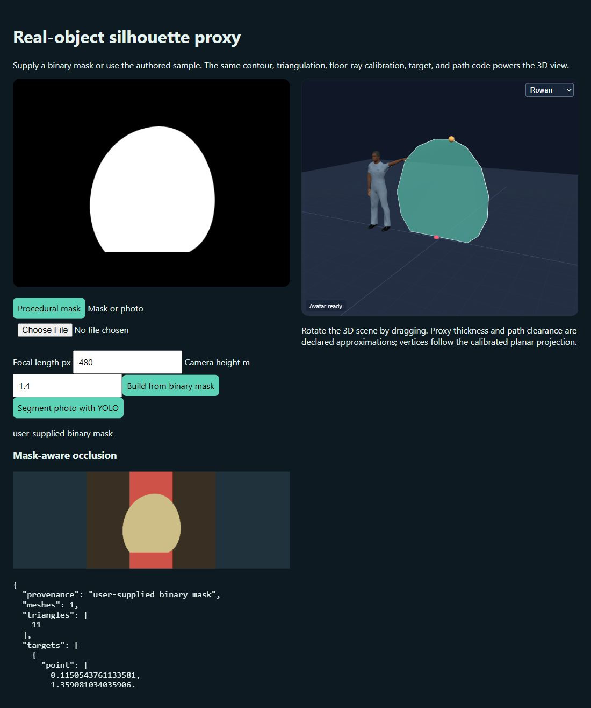

# Silhouettes from Real Objects Enable Realistic Interactions with a Virtual Human in Mobile Augmented Reality

**Hanseob Kim, Ghazanfar Ali, Andréas Pastor, Myungho Lee, Gerard J. Kim, Jae-In Hwang**

**Applied Sciences · 2021** · Published

[Paper / publisher](https://doi.org/10.3390/app11062763) · [Project page](https://ghazanfarali.com/research/silhouette-mobile-ar/) · [Video presentation](https://www.youtube.com/watch?v=75P9iV8M8e8) · [BibTeX](CITATION.bib) · [Requirements](REQUIREMENTS.md) · [Code & setup](#implementation-and-usage)

> Real-object silhouettes give virtual humans spatial context in mobile AR.


*Graphical abstract diagram. Dynamic silhouette proxies support shape-aware occlusion, collision-aware walking and contact with real objects.*

## Why this research

Pre-modeled object proxies are difficult to maintain when a real object's shape or viewpoint changes. Dynamic silhouettes provide visible-shape geometry for virtual-human interaction using the device camera.

A lightweight segmentation pipeline constructs silhouette geometry from camera images of real objects. A virtual character can interact with this geometry and be occluded by it without a pre-modeled object proxy. A mobile animal-doll scenario tests changing views and object deformation.

## Method at a glance

**Camera image** → **Segmentation + silhouette** → **Spatially aware AR interaction**

| | Research system |
|---|---|
| Input | Device-camera images of real objects |
| Method | Segmentation and dynamic silhouette geometry |
| Output | Silhouette geometry for virtual-human occlusion and interaction |

## Evidence and scope

Paper reports a 2.4M-parameter model, 0.971 mIoU, and a 24-person pilot study

**Attribution:** These findings describe the paper or manuscript, not results obtained with this repository's code.

**Study context:** Mobile AR animal-doll scenario.

**Limitations:** Silhouette geometry approximates visible shape; it is not a complete reconstruction of hidden 3D object geometry.

## Explore the implementation

A trainable compressed U-Net with the paper's augmentation and schedule, data preparation from COCO, self-labelled frames or Blender renders, equal-distance silhouette meshes, a class-and-distance update loop, ray-cast and keyword selection, and a browser demo in which depth-only silhouette occluders hide an avatar that points, approaches, follows, pets, pushes and rides. No mobile AR tracking stack or original segmentation weights are supplied.

This repository contains independently written research code. The institute's original source, datasets and trained models are not distributed. Public-data preparation, commands, assumptions and checks are documented below and in [REQUIREMENTS.md](REQUIREMENTS.md).

## Resources and citation

Read the paper through its [publisher record](https://doi.org/10.3390/app11062763). PDFs are hosted by publishers or preprint archives rather than stored in this repository.

Watch the [existing YouTube presentation](https://www.youtube.com/watch?v=75P9iV8M8e8).

Please cite the research paper when using its ideas; [download the BibTeX citation](CITATION.bib). The implementation has its own documented scope.

<!-- demo-preview:start -->
## Demo preview



*Local demo with small starter examples; the capture illustrates the interface, not a reproduced paper benchmark.*

From the repository root, using the Python environment described below:

```sh
python -m pip install -e .
python scripts/start_demo.py
```

Open **http://127.0.0.1:8080/**. The animated sample scene and its authored masks load automatically. Click **Update silhouettes** to rebuild the equal-distance silhouette meshes, select an object (tap it, use **Select at centre (gaze)**, or type or say its class), then try **Point**, **Approach**, **Follow**, **Pet**, **Push** or **Ride**; the depth-only silhouettes hide the avatar wherever the real object is nearer. **Camera source** switches to a webcam or file with one-tap floor calibration, and segmentation can use a trained U-Net on the server or an exported ONNX U-Net in the browser (training and export are documented below). The launcher selects the bundled inputs automatically. Avatar demos prepare their pinned Three.js modules on first launch, so that step needs internet access. Model weights and public datasets are optional for the starter workflow and are prepared separately for real-data use.

The 3D presentation uses shared Three.js avatar components and bundled fictional CC0 characters. The paper-specific algorithms and data adapters live in this repository.

<!-- demo-preview:end -->

## Implementation and usage

<!-- implementation-guide -->

This standalone repository reimplements **“Silhouettes from Real Objects Enable Realistic Interactions with a Virtual Human in Mobile Augmented Reality”** by Hanseob Kim, Ghazanfar Ali, Andréas Pastor, Myungho Lee, Gerard J. Kim, and Jae-In Hwang, *Applied Sciences* 11(6), 2763, 2021. DOI: [10.3390/app11062763](https://doi.org/10.3390/app11062763).

The original institute code, Unity/ARCore application, trained model, DollDataset annotations and experimental assets are not distributed. The pipeline here is: segmentation (a trainable compressed U-Net, or YOLO) → connected instances per class → equal-distance silhouette meshes on a calibrated floor → an update loop with persistent ids → selection, walkable-area planning and avatar interactions in a browser demo.

### Browser demo

```powershell
py -3.11 -m venv .venv
.venv\Scripts\Activate.ps1
pip install -e .
python scripts/start_demo.py          # or: python scripts/prepare_viewer.py; python -m silhouette_ar.demo
```

The demo opens on an animated sample scene: a drawn floor with two toy bears and a rabbit, one bear moving. Its class mask is drawn together with the image, so no model is needed. In the browser:

- **Occlusion.** Each silhouette mesh is rendered depth-only over the camera image (`colorWrite=false`), so it hides the avatar wherever the real object is nearer. *Show silhouettes* overlays the meshes, and *Inspect 3D* orbits the scene.
- **Update loop.** Frames are sent about every 0.6 s. The server matches meshes by class and floor distance, so ids such as `bear-1` persist while an object moves.
- **Selection.** Tap an object to ray-cast through that pixel, use *Select at centre (gaze)*, or type or say a class ("follow the rabbit", "pet bear 2"). *Speak* uses the browser's SpeechRecognition where available; typing works everywhere.
- **Interactions:**
  - *Point* aims the arm.
  - *Approach* walks the A* path to the standing point.
  - *Follow* re-plans after every update toward a point beside the object, outside its footprint by the clearance plus the avatar's body radius. The path keeps the same stand-off, so the avatar does not walk into or stand in front of the object.
  - *Pet* and *Push* walk to the standing point, then reach with two-bone IK: one hand on the body top, or both hands on the mid-height.
  - *Ride* seats the avatar on the tracked silhouette's body top. The seat is re-read on every update and carried between updates, so the avatar stays on a moving object until *Stop* or another action. *Stop* steps the avatar off.
- **Camera sources.**
  - *Webcam* uses `getUserMedia`.
  - *Image or video file* plays an uploaded file.
  - *Tap floor to calibrate* is the one-tap floor calibration: tap a floor point at the given horizontal distance, and the pitch follows from the camera height. Horizontal FOV and camera height are typed in.
- **Segmentation routes:**
  - *Server model* runs a U-Net checkpoint or ONNX export, or YOLO weights: `python -m silhouette_ar.demo --weights outputs/unet/model.pt`.
  - *In-browser ONNX* runs the exported U-Net with onnxruntime-web. Vendor it once with `python scripts/prepare_onnx_web.py` (it is served locally; no CDN at runtime), then start the demo with `--onnx outputs/unet/model.onnx`.
  - *Uploaded mask* takes a binary PNG.

The avatar uses the shared renderer's IK, gaze and seated-posture helpers when present, and falls back to pointing with the earlier renderer. Calibration assumes the principal point at the image centre and a level horizon (pitch only).

**Not reproduced in the web demo:**
- Live mobile AR with on-device segmentation. Camera access in WebXR is Android-only and experimental, so the demo uses a desktop webcam or a file with manual floor calibration instead of ARCore plane tracking and pose.
- The paper's mobile timings (Table 2) and the 30 fps rendering decoupled from a 500 ms pipeline. Timings shown by the demo are desktop server or WASM numbers.

### Segmentation: data, training and export

Install training support with `pip install -e ".[train,onnx,dev]"` (PyTorch, Pillow, onnx, onnxruntime).

The network follows the paper's Section 3.1.2. `silhouette-seg params` prints its size:
- A 4-pooling U-Net with 16 first-level filters and a 192×192 RGB input.
- Multi-class softmax output: background plus K classes.
- 3×3 transposed up-convolutions and batch normalisation: **2,160,194 parameters** for one object class.

The paper reports about 2.4M parameters and quotes a 7.76M reference; a 32-filter U-Net of the same topology has exactly 7,760,130. The remaining layer details are not stated, so the count differs by about 10%. `--up-kernel 2` gives the plain 1,942,594-parameter variant.

Training (`silhouette-seg train`) uses the paper's schedule: Adam at 1e-4, divided by 10 every two epochs, for 5 epochs. Its augmentation, applied on the fly, is:
- background replacement with [Describable Textures Dataset](https://www.robots.ox.ac.uk/~vgg/data/dtd/) images (`--textures <dtd>/images`; procedural textures are used when DTD is not downloaded);
- 0–360° rotation;
- zoom by changing the object's area ratio;
- horizontal and vertical flips.

Every data route writes the same contract:
- `images/<stem>.jpg|png`;
- `masks/<stem>.png`, with 0 = background, 1..K = classes and 255 = ignore;
- `classes.json`, `splits.json` and `provenance.json`.

```powershell
# (a) COCO: "teddy bear" is the closest public class to the paper's animal dolls.
silhouette-seg fetch-coco --out data/coco --categories "teddy bear" --limit 200
#     downloads the 2017 annotation archive (~240 MB), extracts instances_val2017.json, fetches the selected
#     val2017 images one by one and writes data/coco/prepared. With an existing COCO copy:
silhouette-seg prepare-coco --annotations <coco>/annotations/instances_val2017.json --images-dir <coco>/val2017 `
  --categories "teddy bear" --out data/prepared/coco-teddy

# (b) Self-labelled frames (e.g. your own doll videos sampled at 5 fps, or DollDataset images you mask yourself):
silhouette-seg prepare-masks --images frames/ --masks masks/ --classes zebra panda --out data/prepared/dolls
#     binary masks (0/255) become --class-index; indexed or palette PNGs keep their class indices.

# (c) Optional Blender synthetic renders with exact per-object masks (Blender 4.2+, headless):
blender -b --factory-startup -P scripts/blender_synthetic.py -- --out outputs/blender --count 200
silhouette-seg prepare-synthetic --renders outputs/blender --textures <dtd>/images --out data/prepared/synthetic

silhouette-seg train --data data/prepared/coco-teddy --textures <dtd>/images --out outputs/unet
silhouette-seg evaluate --data data/prepared/coco-teddy --weights outputs/unet/model.pt
silhouette-seg export-onnx --weights outputs/unet/model.pt --out outputs/unet/model.onnx
silhouette-seg predict --weights outputs/unet/model.onnx --image frame.jpg
```

Licensing and provenance for the data routes:
- **COCO.** Annotations are CC BY 4.0. Each image keeps its own Flickr licence, which is recorded in `provenance.json`; review the [COCO terms](https://cocodataset.org/#termsofuse) and do not redistribute the prepared folder.
- **Blender (no `--models`).** The generator builds procedural toy figures (`toy-bear`, `toy-rabbit`) from primitives. They are authored by the script and released as CC0.
- **Blender (`--models models.json`).** You list your own free-to-distribute GLB/OBJ assets. Each entry must carry `license` and `source`, and `metadata.json` records them.
- **Renders and textures.** Renders have transparent backgrounds and are composited over textures in `prepare-synthetic`. There is no ground plane, so there are no contact shadows.

The [KISTMRLab DollDataset](https://github.com/KISTMRLab/DollDataset) lists doll image folders under CC BY 4.0, but its listing does not establish aligned masks. Run `python -m silhouette_ar.dataset <downloaded-directory>` to inventory it, then use route (b) with reviewed masks; never treat a thresholded photograph as ground truth. No dataset, image or model is stored in this repository; `data/` and `outputs/` are ignored.

YOLO remains an alternative segmenter. `YoloSegmenter` rebuilds each mask from Ultralytics' `masks.xy` polygons in original-image pixels, so letterboxed mask tensors no longer shift contours, and every instance keeps its class name.

### Command-line geometry

Supply intrinsics, camera height and the downward pitch. The convention is: image `y` down, world `y` up, floor `y=0`, and at zero yaw the camera looks along world `+z`.

```powershell
silhouette-ar --mask .\object-mask.png --label doll --min-area 500 `
  --fx 920 --fy 920 --cx 640 --cy 360 --camera-height 1.4 --pitch 25 --output .\silhouettes.json
silhouette-ar --image .\frame.jpg --weights .\outputs\unet\model.pt `
  --fx 920 --fy 920 --cx 640 --cy 360 --camera-height 1.4 --pitch 25 --output .\silhouettes.json
```

The JSON contains, per mesh:
- class label and instance id;
- pixel contour, triangle indices and world vertices;
- floor contact and floor footprint;
- interaction targets: `point`, `approach`/`stand`, `touch`, `pet`, `push` and `ride`.

Mobile integrations call `build_meshes` with their own intrinsics, camera-to-world rotation, camera origin and detected floor plane, and keep a `SilhouetteTracker` per session.

### Geometry and interaction semantics

**Mesh construction (paper Section 3.2).** For each connected instance of each class (instances under 500 px are dropped):
1. Trace and simplify the outer contour, and ear-clip it.
2. Cast a ray through the bounding box's bottom-midpoint to the floor. `--contact contour` keeps the earlier contour-bottom rule.
3. Place every contour ray at that same distance from the camera.

The mesh is therefore a camera-centred, equal-distance surface: not a plane, and not a reconstruction of hidden geometry. It tilts with the device, so its orthographic projection onto the floor approximates the floor area the object occupies. This works for any yaw, pitch or floor normal. When the camera looks level the projection is thin, so it is padded along the view direction. Instances whose floor ray misses (behind the camera, or parallel to the floor) and contours that cannot be triangulated are skipped with a warning; the rest of the frame is still built.

**Update loop (Section 3.3).** `SilhouetteTracker` matches each new mesh to an existing one with `match_existing`: same class, and floor contacts within 0.35 m. A match keeps the old id with the new geometry. Unmatched meshes get new ids, and tracks unseen for two updates are dropped. Two same-class objects that overlap in the image merge into one region, as with any semantic mask; the hidden object's id can change when they separate.

**Selection (Section 5.1).** `select_by_pixel` intersects the camera ray through a tap or the screen centre with the mesh triangles. `select_by_keyword` matches class names, synonyms and ids such as `bear 2`, preferring the object nearest the camera.

**Walking and touching (Sections 5.2–5.3).**
- `plan_on_floor` rasterises the footprints as holes dilated by the clearance and runs 8-connected A* with an octile heuristic and no corner cutting, then string-pulls the path.
- The standing point for approach, pet and push starts at the centre of the un-walkable area and moves toward the camera until it is outside the dilated hole.
- `body_top` (the highest mask row at least half as wide as the widest row) gives the pet and ride targets without landing on a thin ear. `ride_seat` keeps that height and slides the seat 3 cm inside the floor footprint, because the leaning equal-distance mesh puts its top near the footprint's far edge.
- `follow_point` stands beside the object as seen from the camera, turned 30° toward it, on the side the avatar already occupies. For following, the plan dilates every footprint by the clearance plus the body radius.

**Occlusion.** `occlusion_composite` remains as a 2D per-pixel mask or depth compositor for offline outputs. The browser uses the meshes themselves as depth-only occluders.

### Checks

`pytest -q` covers the following on tiny synthetic data, with no downloads:
- the U-Net parameter count and shapes;
- COCO polygon and RLE conversion, self-labelled and synthetic routes, augmentation alignment, and the learning-rate schedule;
- a two-epoch train, ONNX export and its parity with PyTorch;
- the regression inputs from the code audit: a 90° yaw footprint, a reachable standing point, skipped bad instances, YOLO letterbox polygons and the octile heuristic;
- persistent ids under motion, ray-cast and keyword selection, and the demo's frame, plan and select handlers;
- the follow stand-off and path clearance around a moving object, and the ride seat inside the footprint at the body top.

`python scripts/verify.py` writes inspectable mesh, occlusion, update-loop and path outputs under `outputs/verify/`.

The [automatic-text-to-gesture research implementation](https://github.com/ghazanPK/automatic-text-to-gesture) is a possible gesture source for the virtual human; this repository does not require it.

<!-- avatar-recorded-motion:start -->
## Bundled characters and recorded public motion

The browser demos include Rowan and Mira, two new fictional GLB characters built with MPFB and MakeHuman community assets under CC0 1.0. See [avatar licensing and provenance](static/avatars/LICENSE.md). Use the character selector in the stage. The shared renderer supports body bones, ARKit facial channels, and approximate speaking motion.

Recorded motion is adapted to the characters' proportions. Palm landmarks set hand orientation; finger curl uses bounded hinge bends and preserves the character's finger spacing. Thumb-base opposition stays in the authored pose, with conservative recorded curl at the remaining joints. Distal bends are estimated from the preceding joint when fingertip landmarks are absent. Use the companion's hand close-up views to inspect the result.

The [avatar motion companion](static/recorded-motion.html) opens at `/static/recorded-motion.html` while the demo server is running. A small authored motion and face sample loads automatically; click **Play** without uploading files. It also plays locally selected BEAT motion, face, and WAV files on the bundled characters. These are presentation and data-inspection tools, separate from the paper implementation. No BEAT recording, dataset archive, or trained model is bundled. For recorded public motion, install the one preparation dependency and fetch a small official sample into ignored `outputs/beat-demo/`:

```sh
python -m pip install numpy
python scripts/beat_demo/fetch_modalities.py --speaker 1 --sequence 1_wayne_0_1_1 --include-bvh --max-bytes 25000000 --output-dir outputs/beat-demo/source
python scripts/beat_demo/prepare_bvh.py --bvh outputs/beat-demo/source/1_wayne_0_1_1.bvh --output outputs/beat-demo/sample/1_wayne_0_1_1-raw-motion.json --frames 120
python scripts/beat_demo/prepare_modalities.py --sequence 1_wayne_0_1_1 --source outputs/beat-demo/source --output outputs/beat-demo/sample --frames 120
```

Open the companion and select `outputs/beat-demo/sample/1_wayne_0_1_1-raw-motion.json`, `1_wayne_0_1_1-face.json`, and `1_wayne_0_1_1.wav`. The downloader caps each original file at 25 MB; the prepared clip contains up to 120 frames. The viewer uses local files and does not upload them. For other BEAT takes, substitute a matching official speaker and sequence ID.

If you already have OmniMo's processed 52-joint Unity humanoid data, use that normalized motion instead:

```sh
python scripts/beat_demo/prepare.py --dataset /path/to/processed/beat --speaker 1 --take 1_wayne_0_1_1 --output outputs/beat-demo/sample/1_wayne_0_1_1-motion.json --max-frames 120
```

Select the resulting `*-motion.json` in the companion. Its metadata carries the humanoid joint mapping and source-to-avatar coordinate conversion. The viewer fits source FK directions from the avatar's bind pose, following the spine explicitly at branching joints. This avoids applying incompatible source bone twist to the MPFB skin; it does not reproduce exact performer twist. The adapter supports Unity proximal/intermediate/distal finger names. Raw BVH remains a public-data alternative; do not mix the two skeleton conventions.
<!-- avatar-recorded-motion:end -->

## License

Code is MIT licensed; see [LICENSE](LICENSE). The bundled fictional characters and authored starter fixtures keep their CC0 1.0 dedication, and datasets or models you download keep their own licences.
